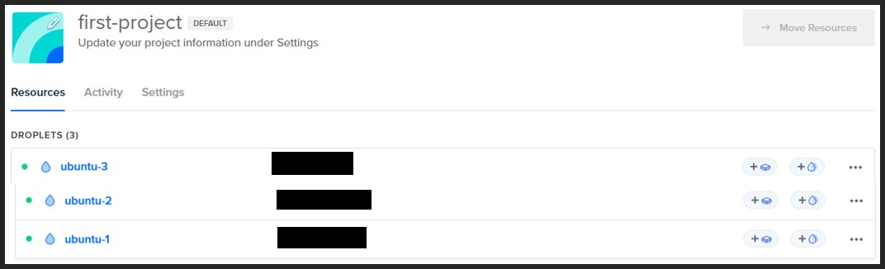
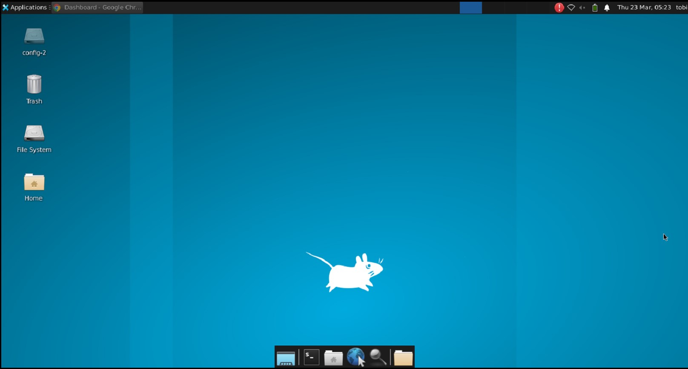

# Set up Digital Ocean VM

* Follow this tutorial to create a Linux VM using Digital Ocean (for the Image, select Ubuntu 22.04 LTS) - https://docs.digitalocean.com/products/droplets/how-to/create/#create-a-droplet-in-the-control-panel

* For the VM that will be used to run the Zabbix Server, a virtual desktop connection is required in order to use the Zabbix Frontend GUI. Follow this tutorial to configure Virtual Network Computing (VNC) - https://www.digitalocean.com/community/tutorials/how-to-install-and-configure-vnc-on-ubuntu-20-04

