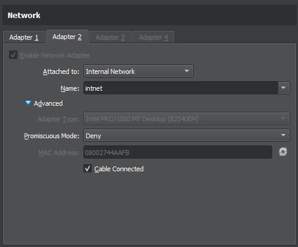
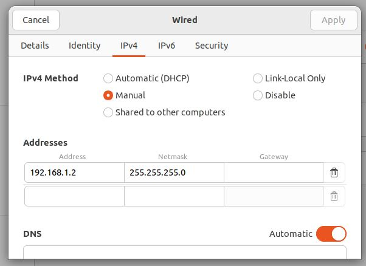

# Set up Oracle Virtual Box VM

* Follow this tutorial to create a Linux VM using Oracle VirtualBox - https://ubuntu.com/tutorials/how-to-run-ubuntu-desktop-on-a-virtual-machine-using-virtualbox#1-overview
* Before logging in to the new VM, in Oracle VirtualBox, set up and internal network connection as shown below (this is used so that Oracle VirtualBox VMs can communicate with each other)

* Start the VM and then go to the network settings. In the network settings window, assign an IP address for the VM on the internal network

* By default Oracle VirtualBox Linux installation will not give sudo access to your user account. To add your user account to the sudoers list, run the following commands:
    * su -
    * usermod -aG sudo myusername