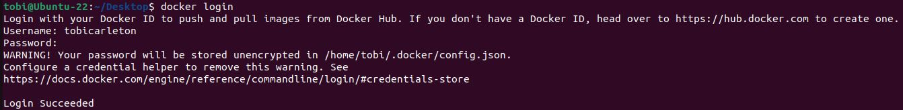
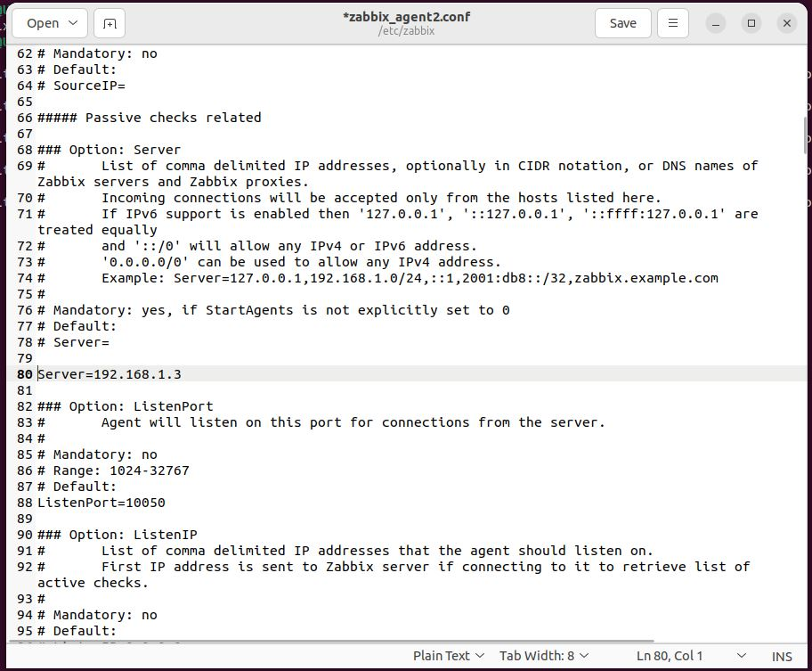

# Project Steps

## Set up Docker Container VM

* Follow this tutorial to create a Linux VM using Oracle VirtualBox - https://ubuntu.com/tutorials/how-to-run-ubuntu-desktop-on-a-virtual-machine-using-virtualbox#1-overview
* Before logging in to the new VM, in Oracle VirtualBox, set up and internal network connection as shown below (this is used so that Oracle VirtualBox VMs can communicate with each other)

* Start the VM and then go to the network settings. In the network settings window, assign an IP address for the VM on the internal network

* By default Oracle VirtualBox Linux installation will not give sudo access to your user account. To add your user account to the sudoers list, run the following commands:
    * su -
    * usermod -aG sudo myusername
* Install Docker CLI by following tutorial in this link - https://docs.docker.com/engine/install/ubuntu/
* Add your username to the docker group, by using the command
    * sudo usermod -a -G docker myusername
* Power on and off the VM for new sudo permissions to take effect
* Create a docker hub account at the following URL (this is needed in order to pull base images required for the OpenAirInterface core network containers) - https://hub.docker.com/
* Once the account has been created, use the Docker CLI through your terminal window to log in to your docker account

* After logging in, pull the following base images, logout, then enable forwarding of Docker container traffic to the outside world
    * docker pull ubuntu:bionic
    * docker pull mysql:8.0
    * docker logout
    * sudo sysctl net.ipv4.conf.all.forwarding=1
    * sudo iptables -P FORWARD ACCEPT
* Next install the Zabbix Agent 2 on your VM by following this link (link provided has been set to the commands for Ubuntu 22.04) - https://www.zabbix.com/download?zabbix=6.4&os_distribution=ubuntu&os_version=22.04&components=agent_2&db=&ws=
* Run this command to add zabbix to the Docker group (this is required so that the Zabbix Agent can monitor the Docker processes) and configure UFW (Uncomplicated Firewall) to allow connections on port 10050 (this is required as the Zabbix server - which will be set up later - uses this port to communicate with the installed Zabbix agent)
    * sudo usermod -aG docker zabbix
    * sudo ufw allow 10050/tcp
* Next edit the Zabbix agent configuration file (located in /etc/zabbix/zabbix_agent2.conf) to add the Zabbix server IP and listen port (here 198.162.1.3 has been used as what will become the Zabbix server IP address, use the value that matches what the IP address of your Zabbix server will be)

* Restart the Zabbix Agent for changes to take effect
    * sudo systemctl restart zabbix-agent2
* Install SSH Server on the VM (this is required so that we can use Ansible Playbook on the Zabbix Server VM to configure/control the Docker Container VM)
    * sudo apt update
    * sudo apt install openssh-server
    * sudo ufw allow ssh
* Clone the OpenAirInterface repository
    * git clone https://gitlab.eurecom.fr/oai/cn5g/oai-cn5g-fed.git
* Now let's test a mini core network deployment (this python script will pull and start the containers for a 5G core network deployment)
    * change directory to "oai-cn5g-fed/docker-compose"
    * sudo python3 core-network.py --type start-mini --scenario 1
* For more information on other possible deployments in the OpenAirInterface repository, follow this link - https://gitlab.eurecom.fr/oai/cn5g/oai-cn5g-fed/-/blob/master/docs/DEPLOY_HOME.md
